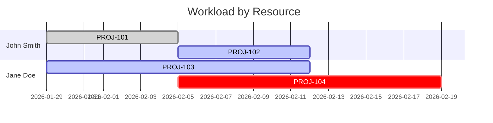

# Gantt Command

Generate Gantt charts showing workload distribution by assigned resource.

## Basic Usage

```bash
jira-ticket-creator gantt --format ascii --weeks 2
```

## Flags

| Flag | Type | Description | Example |
|------|------|-------------|---------|
| `--format` | string | Output format: ascii, mermaid, html | `--format html` |
| `--output` | string | Output file path (default: stdout) | `--output gantt.html` |
| `--weeks` | int | Weeks to display (ascii only, default: 2) | `--weeks 4` |

## Examples

### ASCII Gantt Chart

Display in terminal:

```bash
jira-ticket-creator gantt --format ascii --weeks 2
```

Output:
```
📊 GANTT CHART - WORKLOAD BY RESOURCE
=====================================

Timeline: Jan 29, 2026 to Feb 12, 2026 (2 weeks)

RESOURCE       | Week 1 (Jan 29) | Week 2 (Feb 05) | STATUS
---------------|-----------------|-----------------|-------
John Smith     | ⟳⟳⟳⟳⟳⟳⟳⟳⟳ | ✓✓✓✓✓✓✓✓✓ | 5✓ 3⟳ 0□
Jane Doe       | ⟳⟳⟳⟳⟳⟳⟳⟳⟳ | ⟳⟳⟳⟳⟳⟳⟳⟳⟳ | 0✓ 8⟳ 2□
Bob Wilson     | □□□□□□□□□ | ⟳⟳⟳⟳⟳⟳⟳⟳⟳ | 0✓ 4⟳ 4□
Unassigned     | □□□□□□□□□ | □□□□□□□□□ | 0✓ 0⟳ 3□
```

Status indicators:
- ✓ = Completed
- ⟳ = In Progress
- □ = To Do

### Mermaid Gantt Chart

For documentation/embedding:

```bash
jira-ticket-creator gantt --format mermaid --output gantt.md
```

Embeds in Markdown as:
````markdown

````

### HTML Gantt Chart

Interactive web-based chart:

```bash
jira-ticket-creator gantt --format html --output workload.html
open workload.html
```

Features:
- Colored status indicators
- Team member sections
- Priority labels
- Due dates
- Summary statistics

## Workflow Examples

### Monitor Team Workload

```bash
# Generate weekly workload report
jira-ticket-creator gantt --format ascii --weeks 1

# Generate HTML for sharing
jira-ticket-creator gantt --format html --output weekly-workload.html

# Create Gantt for documentation
jira-ticket-creator gantt --format mermaid --output gantt.md
```

### Track Resource Allocation

```bash
# Create 4-week roadmap
jira-ticket-creator gantt --format ascii --weeks 4

# Show what's assigned to each person
jira-ticket-creator gantt --format html --output team-allocation.html

# Share in GitHub/Notion
jira-ticket-creator gantt --format mermaid --output resource-plan.md
```

### Project Planning

```bash
# Visualize team capacity
jira-ticket-creator gantt --format html --output capacity.html

# Generate Gantt for stakeholders
jira-ticket-creator gantt --format mermaid --output gantt.md
cat gantt.md | pbcopy  # Copy to clipboard

# Share with team
jira-ticket-creator gantt --format html --output team-gantt.html
# Send team-gantt.html to Slack/Email
```

## Combining with Other Commands

### Full Analysis Workflow

```bash
# 1. Import tickets
jira-ticket-creator import --jql "project = PROJ" --map-project backend

# 2. View team reports
jira-ticket-creator team summary --project backend

# 3. Check assignments
jira-ticket-creator team assignments --project backend

# 4. Generate Gantt
jira-ticket-creator gantt --format html --output backend-gantt.html

# 5. Create presentation
jira-ticket-creator pm dashboard > dashboard.txt
```

### Weekly Status Report

```bash
#!/bin/bash
# weekly-status.sh

DATE=$(date +%Y-%m-%d)
REPORT_DIR="reports/$DATE"
mkdir -p "$REPORT_DIR"

# Generate all reports
jira-ticket-creator gantt --format html --output "$REPORT_DIR/gantt.html"
jira-ticket-creator pm dashboard > "$REPORT_DIR/dashboard.txt"
jira-ticket-creator team summary > "$REPORT_DIR/team-summary.txt"

echo "Reports generated in $REPORT_DIR"
```

## Status Summary

Each resource row shows a summary: `5✓ 3⟳ 2□`

- `5✓` = 5 completed tickets
- `3⟳` = 3 in-progress tickets
- `2□` = 2 to-do tickets

### Understanding the Timeline

The ASCII chart shows weekly breakdown. Each column represents one week.

```
Week 1 (Jan 29) | Week 2 (Feb 05)
⟳⟳⟳⟳⟳⟳⟳⟳⟳ | ✓✓✓✓✓✓✓✓✓
```

Visual meanings:
- All progress (⟳) = Actively working
- All complete (✓) = Completed work
- All todo (□) = No assignments
- Mixed (⟳✓) = Mix of completed and in-progress

## Output Formats Comparison

| Format | Use Case | Output |
|--------|----------|--------|
| ASCII | Terminal, quick view | Text table |
| Mermaid | Documentation, GitHub, Notion | Embedded diagram |
| HTML | Web, sharing, presentations | Interactive page |

### Choose Format By:

- **Terminal monitoring**: Use ASCII
- **GitHub documentation**: Use Mermaid
- **Email reports**: Use HTML
- **Stakeholder presentations**: Use HTML
- **Markdown documents**: Use Mermaid

## Tips & Tricks

1. **Weekly monitoring**
   ```bash
   watch -n 86400 'jira-ticket-creator gantt --format ascii'
   ```

2. **Automated reports**
   ```bash
   # Add to crontab
   0 9 * * 1 jira-ticket-creator gantt --format html --output ~/reports/weekly.html
   ```

3. **Compare periods**
   ```bash
   # Current week
   jira-ticket-creator gantt --weeks 1 --output current.txt

   # Previous week (check git history)
   git show HEAD~1:current.txt

   # Compare
   diff current.txt <(git show HEAD~1:current.txt)
   ```

4. **Share with team**
   ```bash
   jira-ticket-creator gantt --format html --output gantt.html
   # Upload to shared drive
   cp gantt.html /Volumes/SharedDrive/team-gantt.html
   ```

## See Also

- [Team Reports](./team.md)
- [Project Management](./pm.md)
- [Reports](./reports.md)
